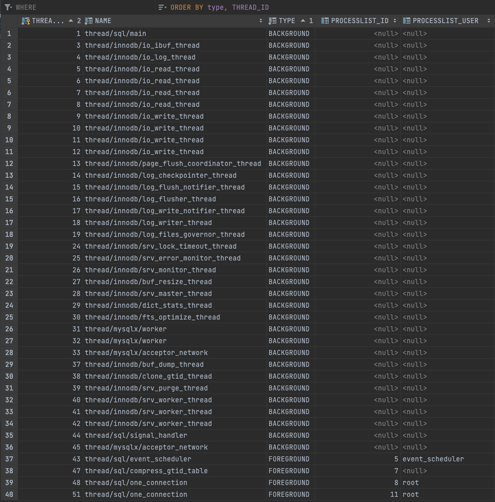

# Real MySQL 8.0 8.0 (3) - 아키텍처
- MySQL 서버는 사람의 머리 역할의 MySQL 엔진과 손발 역할의 스토리지 엔진으로 구분
- 스토리지 엔진의 경우 핸들러 API를 만족하면 누구든지 스토리지 엔진을 구현해 MySQL 서버에 추가해서 사용 가능
- 기본제공되는 스토리지 엔진
  - InnoDB
  - MyISAM

***
## MySQL 엔진 아키텍처
MySQL 서버는 다른 DBMS에 비해 구조가 독특해 다른 DBMS에는 없는 혜택을 누릴 수 있으며, 반대로 다른 DBMS에서는 문제되지 않을 것들이 문제될 때가 있다. 크게 MySQL 엔진과 스토리지 엔진으로 구분한다

### MySQL 엔진
- 커넥션 핸들러
- SQL 인터페이스
- SQL 파서, 전처리기
- SQL 옵티마이저
- 캐시 & 버퍼

### 스토리지 엔진
- InnoDB or MyISAM
- Memory

실제 데이터를 디스크 스토리지에 저장하거나 읽어오는 부분을 전담

MySQL 서버에 MySQL 엔진은 하나지만, 스토리지 엔진은 여러 개를 동시에 사용 가능
```mysql
CREATE TABLE table_name (col1 INT, col2 INT) ENGINE=INNODB;
```
위와 같이 지정하면 SELECT, INSERT, DELETE, UPDATE 등의 작업 시 InnoDB 스토리지 엔진이 처리를 담당

각 스토리지 엔진은 성능 향상을 위해 키 캐시(MyISAM)나 InnoDB 버퍼 풀(InnoDB) 같은 기능을 내장

### 핸들러 API
- 핸들러(Handler) 요청에 사용되는 API
- 핸들러 요청
  - MySQL 엔진이 쿼리 실행기에서 데이터를 쓰거나 읽을 떄, 각 스토리지 엔진에 쓰기 또는 읽기를 요청하는 것
- InnoDB 스토리지 엔진도 핸들러 API를 사용해 MySQL 엔진과 데이터를 주고 받는다.
- 핸들러 API를 통해 얼마나 많은 데이터(레코드) 작업이 있는 지 확인
  - `SHOW GLOBAL STATUS LIKE 'Handler%';`

### MySQL 스레딩 구조
- MySQL 서버는 프로세스 기반이 아닌 스레드 기반
- 크게 Foreground thread와 Background thread로 구분
- `performance_schema.threads table`

- `thread/sql/one_connection` 스레드만 실제 사용자의 요청을 처리하는 Foreground threads
- background threads의 개수는 MySQL 서버 설정에 따라 달라질 수 있다.
- 동일한 이름의 스레드가 2개 이상씩 보이는 것은 MySQL 서버의 설정 내용에 의해 여러 스레드가 동일 작업을 병렬로 처리하는 경우
- MySQL의 커뮤니티 에디션
  - 전통적인 스레드 모델 사용 가능 
- MySQL의 엔터프라이즈 에디션과 Percona MySQL
  - 전통적인 스레드 모델 사용 가능
  - 스레드 풀(thead pool) 모델 사용 가능
- 전통적인 스레드 모델과 스레드 풀의 가장 큰 차이점은 Foreground thread와 connection의 관계
  - 전통적인 스레드 모델: Foreground thread와 connection이 1대1 관계(connection 별로 Foreground thread 생성)
  - 스레드 풀 모델: 하나의 스레드가 여러 개의 커넥션 요청을 전담

#### Foreground thread(client thread)
- Foreground thread의 최소 개수는 MySQL 서버에 접속된 클라이언트의 수
- 주로 각 클라이언트가 요청하는 쿼리 문장을 처리
- 클라이언트가 작업을 마치고 커넥션을 종료하면 담당 스레드는 스레드 캐시(thread cache)로 되돌아감
- 스레드 캐시에 일정 개수 이상의 대기 스레드가 있으면 스레드 캐시에 넣지 않고 스레드를 종료
- 스레드 캐시에 유지할 수 있는 최대 스레드 수: `thread_cache_size` 시스템 변수
- read
  1. 데이터를 MySQL 데이터 버퍼나 캐시에서 조회
  2. 없으면 디스크의 데이터나 인덱스 파일로부터 조회
- write
  - MyISAM의 경우, 디스크 쓰기 작업까지 Foreground thread가 처리
  - InnoDB의 경우, 데이터 버퍼나 캐시까지만 Foreground thread가 처리 / 버퍼부터 디스크까지는 Background thread가 처리

#### Background thread
보통은 InnoDB의 Background thread가 진행하는 작업
- 인서트 버퍼를 병합하는 스레드
- 로그를 디스크로 기록하는 스레드
- InnoDB 버퍼 풀의 데이터를 디스크에 기록하는 스레드
- 데이터를 버퍼로 읽어오는 스레드
- 잠금이나 데드락을 모니터링하는 스레드

5.5부터 데이터 쓰기 스레드와 읽기 스레드의 개수를 2개 이상 지정 가능(시스템 변수)
- `innodb_write_io_threads`
- `innodb_read_io_threads`
- InnoDB도 데이터 read는 주로 foreground thread에서 처리하기 때문에, read thread를 많이 설정할 필요 없다.
- write thread는 아주 많은 작업을 백그라운드로 처리하기 때문에, 일반적으로 내장 디스크를 사용할 때는 2~4 정도 설정(스토리지에 따라 최적화 필요)

**버퍼링**
- 쓰기 작업은 지연(버퍼링)되어 처리 가능
- 읽기 작업은 지연 불가능
- InnoDB는 쓰기작업을 버퍼링해서 일괄 처리
  - INSERT, UPDATE, DELETE 시, 데이터가 디스크의 파일로 완전히 저장될 때까지 기다리지 않아도 된다.
- MyISAM은 client thread가 쓰기까지 처리
  - 쓰기 버퍼링 사용 불가

### 메모리 할당 및 사용 구조
- 운영체제의 복잡한 할당 방식으로 할당
- 단순하게 MySQL의 시스템 변수로 설정해둔 만큼 할당 받는다고 생각
- MySQL 서버
  - 글로벌 메모리 영역
    - 클라이언트의 수와는 무관
    - 필요에 따라 N개 할당 가능(일반적으로 1개)
    - N개더라도 모든 스레드에 의해 공유
    - 종류
      - InnoDB 버퍼 풀
      - MyISAM 키 캐시
      - 바이너리 로그 버퍼
      - 리두 로그 버퍼
      - 테이블 캐시
  - 세션(커넥션, 로컬) 메모리 영역
    - 클라이언트 스레드가 쿼리를 처리하는 데 사용하는 메모리 영역
    - 커넥션당 생성되는 스레드가 사용하는 영역
    - 스레드간 독립적, 비공유
    - 커넥션이 열려있는 동안 계속 할당되어 있는 공간(커넥션 버퍼, 결과 버퍼)
    - 쿼리를 실행하는 순간에만 할당했다가 다시 해제하는 공간(소트 버퍼, 조인 버퍼)
      - 조인 버퍼
      - 정렬(sort) 버퍼
      - 네트워크 버퍼
      - 리드 버퍼
