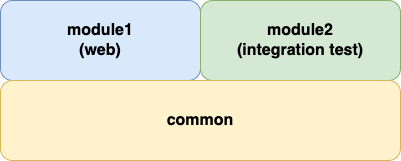

# Multi module project
## root project
#### setting.gradle
```groovy
rootProject.name = 'multi-module'
include 'module1'
include 'module2'
include 'common'
```
#### build.gradle
```groovy
buildscript {
    ext {
        springBootVersion = '3.0.6' //spring boot version
    }
    repositories {
        mavenCentral()
    }
    dependencies {
        //project에서 사용할 spring boot plugin classpath 설정
        classpath("org.springframework.boot:spring-boot-gradle-plugin:${springBootVersion}")
        //project에서 사용할 spring gradle dependency management plugin classpath 설정
        classpath "io.spring.gradle:dependency-management-plugin:1.1.0"
    }
}

allprojects {
    //include root project
    repositories {}
    dependencies {}
}

subprojects {
    //exclude root project
    group 'com.study'

    //plugin 관리
    apply plugin: 'idea'
    apply plugin: 'java'
    apply plugin: 'org.springframework.boot'
    apply plugin: 'io.spring.dependency-management'

    repositories {
        mavenCentral()
    }

    //lombok
    configurations {
        compileOnly {
            extendsFrom annotationProcessor
        }
    }

    dependencies {
        //lombok
        compileOnly 'org.projectlombok:lombok:1.18.26'
        annotationProcessor 'org.projectlombok:lombok:1.18.26'

        testImplementation 'org.springframework.boot:spring-boot-starter-test'
        testImplementation 'org.junit.jupiter:junit-jupiter-api:5.8.1'
        testRuntimeOnly 'org.junit.jupiter:junit-jupiter-engine:5.8.1'
    }

    test {
        useJUnitPlatform()
    }
}

project(':module1') {
    //each project(web), :path
    dependencies {
        implementation project(':common')
    }
}

project(':module2') {}
```

## module project
module1(web), module2(integration-test), common 3개의 module로 구성

[](./multi-module.png){:.glightbox}

***
### module1
api server를 위한 module
#### build.gradle
```groovy
plugins {
    id 'groovy'
}

group 'com.study.module1'
version = '0.0.1-SNAPSHOT'
sourceCompatibility = '17'

dependencies {
//    implementation project(':common') //root의 build.gradle에서 설정

    implementation 'org.springframework.boot:spring-boot-starter-web'

    implementation 'org.springframework.boot:spring-boot-starter-data-jpa'
    runtimeOnly 'com.h2database:h2'

    //mandatory
    implementation platform('org.apache.groovy:groovy-bom:4.0.5')
    implementation 'org.apache.groovy:groovy'
    testImplementation platform("org.spockframework:spock-bom:2.3-groovy-4.0")
    testImplementation "org.spockframework:spock-core"
    //optional
    testImplementation "org.hamcrest:hamcrest-core:2.2"   // only necessary if Hamcrest matchers are used
    testRuntimeOnly 'net.bytebuddy:byte-buddy:1.12.17' // allows mocking of classes (in addition to interfaces)
    testRuntimeOnly "org.objenesis:objenesis:3.3"
    // allows mocking of classes without default constructor (together with ByteBuddy or CGLIB)
    
    testImplementation group: 'org.mockito', name: 'mockito-core', version: '5.3.0'
}

test {
    testLogging {
        events "passed", "skipped", "failed"
    }
}
```

***
### module2
integration test를 위한 module
#### build.gradle
```groovy
plugins {}

group 'com.study.module2'
version = '0.0.1-SNAPSHOT'
sourceCompatibility = '17'

dependencies {
    implementation project(':common') //root의 build.gradle에서 설정하지 않고 module2의 build.gradle에서 설정
    implementation 'org.springframework.boot:spring-boot-starter-web'

    testImplementation 'io.rest-assured:rest-assured:5.3.0'
}

bootJar {
    //include main method: true
    enabled = false
}

jar {
    enabled = true
}
```

***
### common
web module과 integration test module의 공통 dto를 위한 common module
#### build.gradle
```groovy
plugins {}

group 'com.study.common'

dependencies {}

bootJar {
    //include main method: true
    enabled = false
}

jar {
    enabled = true
}
```