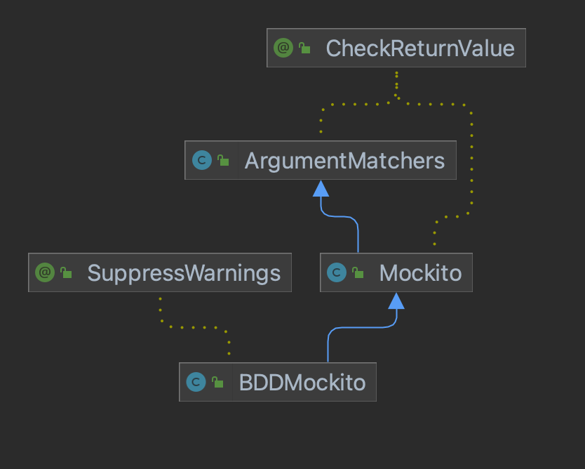

# Mockito
- 모의 객체 생성, 검증, 스텁을 지원하는 프레임워크

> 공식 문서: https://javadoc.io/static/org.mockito/mockito-core/5.3.1/org/mockito/Mockito.html <br>
> 공식 github: https://github.com/mockito/mockito

***
## org.mockito.Mockito

### 모의 객체 생성
- Mockito.mock(T... reified)
- 클래스, 인터페이스, 추상클래스에 대해 모의 객체 생성 가능

***
## org.mockito.BDDMockito

### stub: given
- 실행될 method, arguments를 지정하고, 그에 따른 return을 지정 -> stub
- BDDMockito.given(T methodCall)
- BDDMockito.willReturn(Object toBeReturned)
- BDDMockito.willThrow(Class<? extends Throwable> toBeThrown)
- 일치하는 stub이 없으면 해당 method의 return type의 default 값을 반환(Object: null, int: 0, ...)

```java
public class MockitoTest {

    @Test
    void mockTest() {
        List<String> mockList = mock(List.class);

        given(mockList.get(0)).willReturn("index 0번의 값");
    }
}
```

### 행위검증: then
- BDDMockito.then(T mock)
- should()의 arg
  - Mockito.only()
  - Mockito.times(int)
  - Mockito.atLeastOnce()
  - Mockito.atLeast(int)
  - Mockito.atMostOnce()
  - Mockito.atMost(int)
  - Mockito.timeout(long)
  - Mockito.after(long)

```java
public class MockitoTest {

    @Test
    void mockTest() {
        List<String> mockList = mock(List.class);
        mockList.add("index 0번의 값");
    
        then(mockList).should(only()).add(anyString());
    }
}
```

### 기타: when(), verify()

***
## org.mockito.ArgumentMatchers
- 정확하게 일치하는 값 대신 임의의 값 가능
  - any()
  - anyInt(), anyShort(), anyLong(), anyByte() ...
  - anyString()
  - anyList(), anySet(), anyMap(), anyCollection()
- 특정 값(정규식)과의 일치 여부
  - matches(String), matches(Pattern)
  - eq(값)

### ArgumentMatchers 주의사항
다음과 같은 코드는 exception이 발생한다.
```java
public class MockitoTest {

    @Test
    void mockTest() {
        List<String> mockList = mock(List.class);

        given(mockList.set(anyInt(), "123")).willReturn("456");

        String result = mockList.set(0, "123");
        assertEquals("456", result);
    }
}
```

인자에 하나라도 ArgumentMatchers를 사용했으면, 모든 인자에 ArgumentMatchers를 사용해야한다. 따라서 다음과 같이 작성한다.

```java
public class MockitoTest {

    @Test
    void mockTest() {
        List<String> mockList = mock(List.class);
      
        given(mockList.set(anyInt(), eq("123"))).willReturn("456"); //"123" -> ArgumentMatchers.eq("123")
      
        String result = mockList.set(0, "123");
        assertEquals("456", result);
    }
}
```



***
## org.mockito.ArgumentCaptor

```java
public class MockitoTest {

    @Test
    void mockTest() {
        ArgumentCaptor<String> captor = ArgumentCaptor.forClass(String.class);
        List<String> mockList = mock(List.class);
        mockList.add("index 0번의 값");

        then(mockList).should(only()).add(captor.capture());

        assertEquals("index 0번의 값", captor.getValue());
    }
}
```

***
## JUnit5 확장 설정
- [maven repository](https://mvnrepository.com/artifact/org.mockito/mockito-junit-jupiter)
- @ExtendWith(MockitoExtension.class)를 선언하면 @Mock, @Captor등을 통해 자동 injection이 가능하다.

```java
@ExtendWith(MockitoExtension.class)
public class MockitoTest {

    @Mock
    private List<String> mockList;
    @Captor
    private ArgumentCaptor<String> captor;

    @Test
    void mockTest() {
        mockList.add("index 0번의 값");

        then(mockList).should(only()).add(captor.capture());

        assertEquals("index 0번의 값", captor.getValue());
    }
}
```